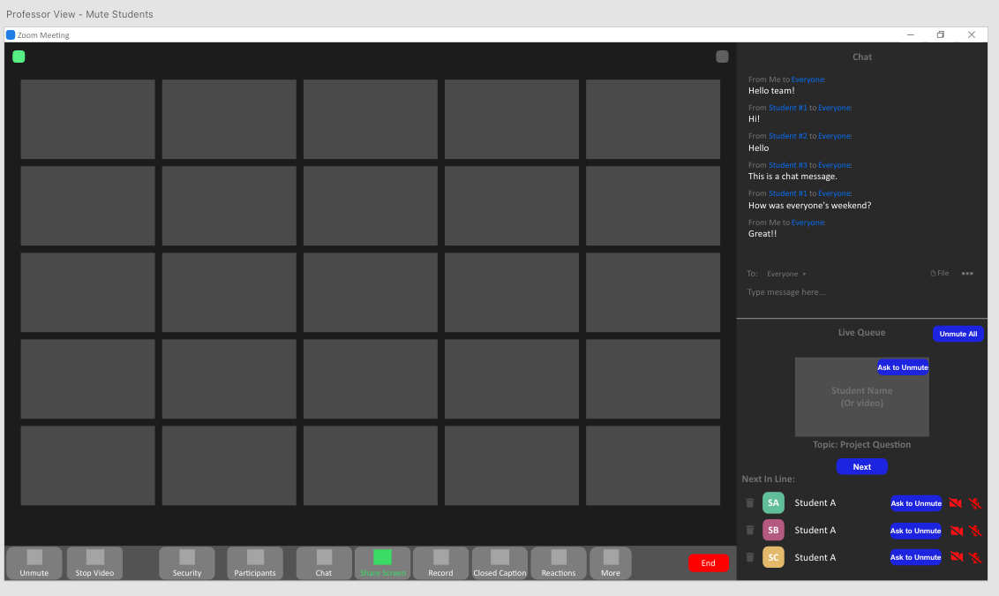

Milestone 3
================

Milestone 3 Proposal for the Lightning Sharks Team Proposal. By Josh Weintraub, Eric Miller, Alec Oortman, Alexander Costa, and Daniel Grotch

**Note**: With approval from Dr. Cotterell, we removed the tiered point system from our project.

User Experience Requirements
************************************

1. Anonymous Questions
-----------------------

:1.1: As a professor, I want to be able answer a series of anonymous questions from my students, so that I may interact with them without putting them in the spotlight.

:1.2: As a student, I want to be able to ask a question during class but not reveal my identity so that I can participate while avoiding judgement from other students.

2. Live Queue
--------------

:2.1: As a professor, I want to see a queue of questions so that I can make it easier for students virtual and physical to solicit input on class subjects without talking over each other or asking repetitive questions that may arise from inability to properly converse between in-person and virtual-students.

:2.2: As a Professor, I want each student to be muted until it is their designated time to ask a question, so that they are not all talking over each other trying to get my attention.

:2.3: As a student, I want to be able to add my question to a queue, so that I may get the opportunity to have my question answered instead of it being overlooked in a series of submitted inquiries.

3. Settings
----------------

:3.1: As a professor, I want to have a dedicated panel (a sort of "landing page" component) for these new options so I can easily enable/disable them and adjust their settings from one place.

All six user stories are essential to the design of the application. For the first section of user stories, anonymous questions are essential in allowing all users to participate in the class conversation. While many people have "video anxiety"[1]_, where they have difficulty talking in front of a camera to ask questions, the anonymous questions feature will allow them to participate without putting the students in the spotlight.

The next set of user stories, regarding the live queue, is essential to enabling an organized Zoom meeting. Video chats, especially in large settings such as a class, are often tarnished by common interruptions [2]_, which can be avoided by giving the professor control, where one person speaks at a time. This may also serve to curve gender biases, as women are commonly interrupted during meetings [3]_, which would not happen if everyone is given a reserved time to ask questions. Giving the professor options to mute users will also solve the problem of too much noise entering the chat, which is mostly an issue in larger video chats [4]_.

Finally, the settings panel will give professors the option to actually enable all these features from one place, which is essential to rolling out the new features.

Ideation and Preliminary Designs
*********************************

Note that we had a panel for the participation options for all students/instructors originally (which is included in some wireframes), but was removed once we decided to remove the point tier system. These do not appear in the mockups.

1.1: Instructor able to read anonymous questions
---------------------------------------------------
    :1.1.a: The first design option has anonymous questions show up in the chat, with labels such as "Student #1" and "Student #2" in order to keep these questions consistent. The idea here is that the design of Zoom won't be overcrowded if we include anonymous questions in the same place as the main chat.

        .. image:: wireframes/1_1_a.png
            :width: 600

        :download:`Download Source File <./wireframes/1_1_a.xd>`.

    :1.1.b: The second design option has anonymous questions as a separate panel, under the chat panel. This idea increases modularity, and makes it easier for the users to notice that it is a new feature.

        .. image:: wireframes/1_1_b.png
            :width: 600

        :download:`Download Source File <./wireframes/1_1_b.xd>`.

    :1.1.c: The third design option is similar to the previous, in that the anonymous questions component has its own panel, but the panel is on the other side of the screen. This gives more space for the questions, so that the professor will (in most cases) not have to scroll as often.

        .. image:: wireframes/1_1_c.png
            :width: 600

        :download:`Download Source File <./wireframes/1_1_c.xd>`.

1.2: Students able to send anonymous questions
------------------------------------------------
    :1.2.a: The first design option has a component towards the middle of the screen for students to submit anonymous questions. The student may simply input the question and choose a topic (potentially from a list determined by the professor) about the question. This gives the option for organization, in case we want to eventually give the option to filter questions by topic. Also, the fact that other anonymous questions are not shown increases user privacy.

        .. image:: wireframes/1_2_a.png
            :width: 600

        :download:`Download Source File <./wireframes/1_2_a.xd>`.

    :1.2.b: The second design option has a similar component, where the students have the option to send in an anonymous question and to see all previous questions asked. By seeing others' questions, the students can have a better sense of context when the professor answers said questions.

        .. image:: wireframes/1_2_b.png
            :width: 600

        :download:`Download Source File <./wireframes/1_2_b.xd>`.

    :1.2.c: The third design option is integrated into the main chat. The "send anonymously" button allows the users to anonymize their messages in the chat. The integration of these features removes potential clunkiness of the design. Also, since the chat already has the option to send directly to the professor, students will be able to choose whether or not the entire chat sees the question.

        .. image:: wireframes/1_2_c.png
            :width: 600

        :download:`Download Source File <./wireframes/1_2_c.xd>`.

2.1: Instructor able to view queue questions
------------------------------------------------
    :2.1.a: The instructor sees the video of the student who is at the front of the queue. This is a minimalistic design that shows all pertinent information.

        .. image:: wireframes/2_1_a.png
            :width: 600
        
        :download:`Download Source File <./wireframes/2_1_a.xd>`.

    :2.1.b: The instructor sees the video of the student at the front of the queue, as well as a list of participants who are next in the queue. This gives the professor more information, with a relatively minimalistic design.

        .. image:: wireframes/2_1_b.png
            :width: 600

        :download:`Download Source File <./wireframes/2_1_b.xd>`.

    :2.1.c: The instructor sees the same as the above, but also the topic of each question. This provides the maximum possible amount of information to the professor without making the design too clunky.

        .. image:: wireframes/2_1_c.png
            :width: 600

        :download:`Download Source File <./wireframes/2_1_c.xd>`.

2.2: Instructor able to set mute options
------------------------------------------------

(Note that these designs will eventually be integrated into the above user story's component once a design is chosen for that, but for now we represent them in a separate panel).

    :2.2.a: The initial design has no mute options in the live queue. This keeps things relatively simple, but does not satisfy the user story requirement.

        .. image:: wireframes/2_2_a.png
            :width: 600

        :download:`Download Source File <./wireframes/2_2_a.xd>`.

    :2.2.b: The next design gives the professor the option to request the current student (or all students) to unmute. This can be used to encourage participation.

        .. image:: wireframes/2_2_b.png
            :width: 600

        :download:`Download Source File <./wireframes/2_2_b.xd>`.

    :2.2.c: The final design gives the professor only the option to unmute the current student in the queue, for the same reason as above. The disclusion of the "unmute all" button is due to the fact that this option is not necessarily pertinent to the live queue, but more Zoom as a whole.

        .. image:: wireframes/2_2_c.png
            :width: 600

        :download:`Download Source File <./wireframes/2_2_c.xd>`.

2.3: Students able to see/enter queue
--------------------------------------
(Note that in further stages, this will be modified to fit in better with the instructor view of the queue).

    :2.3.a: The first design option shows a component for the queue, whether it's open, and the order of students in the queue. There is also a button at the bottom to enter/exit the queue. This is done as a separate compoennt, as it does not fit semantically into any existing components.

        .. image:: wireframes/2_3_a.png
            :width: 600

        :download:`Download Source File <./wireframes/2_3_a.xd>`.

    :2.3.b: The second design option shows a similar component for the queue, except there is no list of students (as this is not pertinent information for the student in the queue). Instead, it shows the student's place in line, as well as an estimated wait time.

        .. image:: wireframes/2_3_b.png
            :width: 600

        :download:`Download Source File <./wireframes/2_3_b.xd>`.

3.1: Instructor Settings
--------------------------

    :3.1.a: The first design gives the instructor access to their three options: anonymous questions, the live queue, and mute options. Upon clicking, the panel will be replaced with the setting options depending on which was clicked, which is a relatively simple flow for them to understand. Note that the panel (in both designs) will be openable/collabsable via a button in the bottom toolbar.

        .. image:: wireframes/3_1_a.png
            :width: 600

        :download:`Download Source File <./wireframes/3_1_a.xd>`.

    :3.1.b: The second design has the same options, but opens the main settings window for Zoom, under the section chosen. This has the added benefit of keeping everything under Zoom's existing settings page, but it is more clunky.

        .. image:: wireframes/3_1_b.png
            :width: 600

        :download:`Download Source File <./wireframes/3_1_b.xd>`.

Detailed Designs
*********************************

1.1: Instructor able to read anonymous questions
---------------------------------------------------

1.2: Students able to send anonymous questions
------------------------------------------------

2.1: Instructor able to view queue questions
------------------------------------------------
We based this mockup on the third design option (2.1.c), as it is relatively clean and gives instructors (the admins) the most information of all design options. We chose to make the current student's video resemble the existing Zoom video panel, and the students in line resemble the "participants" panel, in order to provide familiarity to instructors. A delete button was also included to remove students from the queue, and to give more autonomy to the instructor.

.. image:: mockups/2_1.png
    :width: 600

:download:`Download Source File <./mockups/2_1.xd>`.

2.2: Instructor able to set mute options
------------------------------------------------
We chose option 2.2.b for this user story. Giving the professor the option to mute/unmute users increases organization (as discussed earlier), and the unmute all button increases organization. The design was modified to fit in with mockup 2.1, and the "ask to unmute" buttons resemble those currently in Zoom for familiarity reasons.

:download:`Download Source File <./mockups/2_2.xd>`.

2.3: Students able to see/enter queue
--------------------------------------
Option 2.3.b was chosen for this design, as the first option showed information that was not relevant/pertinent for the student to know (which students were in the queue). Also, this was moved to be a panel under the chat (as is done in the professor view), so that the component would not obstruct the main part of the screen. Finally, a box was added in for users to type in a topic when they are in the queue, in order to work with the design option chosen for 2.1.

.. image:: mockups/2_3.png
    :width: 600

:download:`Download Source File <./mockups/2_3.xd>`.

3.1: Instructor Settings
--------------------------
We chose option 3.1.a, where everything stays in the same panel instead of opening the settings window, so the instructor has easier access to enabling/disabling these common features. The buttons, when clicked, will simply be enable/disable buttons, so only one artboard was used. Also, this was moved to be under the chat for the same non-obstruction feature as before.

.. image:: mockups/3_1.png
    :width: 600

:download:`Download Source File <./mockups/3_1.xd>`.

Video Summary
**************

Citations
**********
.. [1] `Why Aren't You Zooming? The Fear And How To Cope With It. <https://blog.zoom.us/arent-zooming-yet-fear-cope/>`_
.. [2] `How to Stop Interrupting People in Virtual Meetings <https://www.linkedin.com/business/learning/blog/career-success-tips/how-to-stop-interrupting-people-in-virtual-meetings>`_
.. [3] `It’s Not Just You: In Online Meetings, Many Women Can’t Get a Word In <https://www.nytimes.com/2020/04/14/us/zoom-meetings-gender.html>`_
.. [4] `When should you mute yourself during a video call? <https://zapier.com/blog/when-to-mute-video-calls/>`_